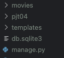
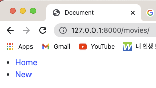
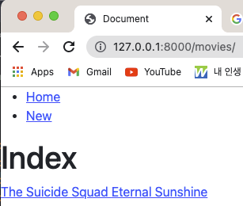
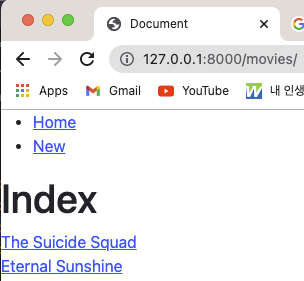
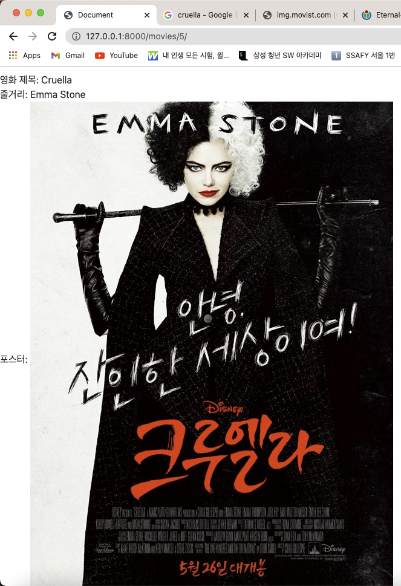
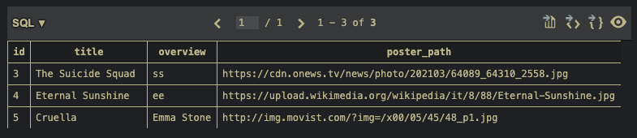
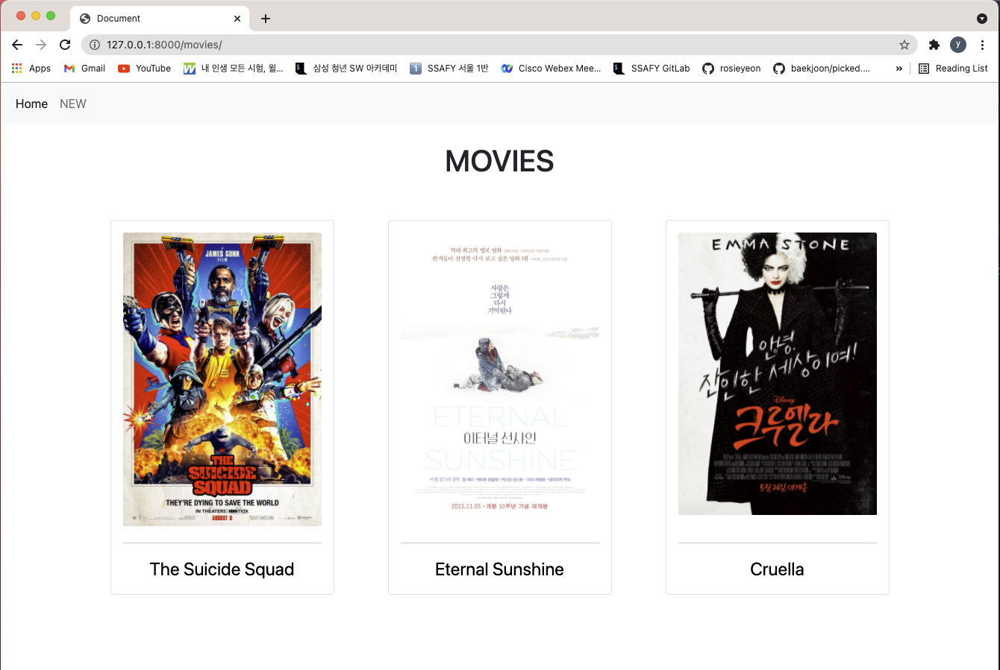
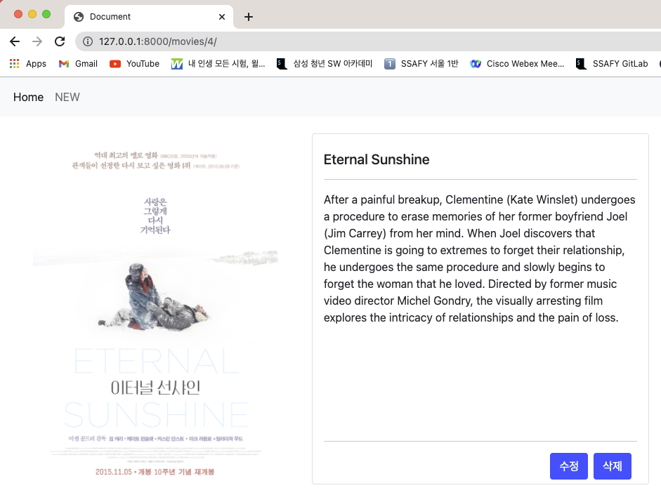
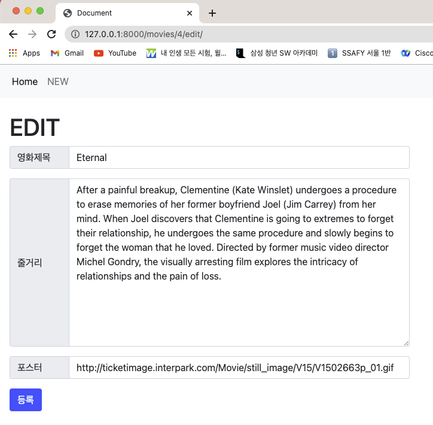
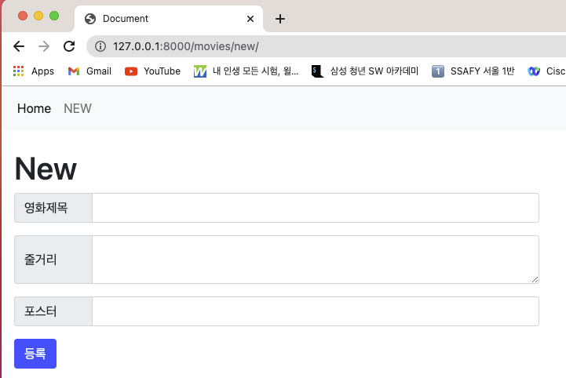

# PJT04. 프레임워크 기반 웹 페이지 구현

</br>

## 1. 구현 과정

주어진 조건을 만족시키며 단계별로 페이지를 구현했다.

### A. 프로젝트 구조

```python
$ django startproject pjt04
```

project 디렉토리의 이름을 pjt04로 생성한 뒤 이 폴더 안에 들어가서 application 디렉토리를 생성

```python
$ django startapp movies 
```



위의 사진과 같이 `movies` , `pjt04` ,`manage.py` 가 생성된다.

</br>

### B. Model

조건에 맞는 모델 클래스를 만들기 위해 다음과 같이 정의해주었다.

```python
class Movie(models.Model):
    title = models.CharField(max_length=100)
    overview = models.TextField()
    poster_path = models.CharField(max_length=500)
```

`title` 과 `poster_path` 의 경우 자료형의 크기에 대한 조건이 주어졌으므로 `CharField` 를 사용해주었고 각각 `max_length` 를 100 과 500으로 설정해주어 조건을 만족시켰다. 이후 마이그레이션을 통해 동기화했다. 마이그레이션은 다음과 같이 진행한다.

```python
$ python manage.py makemigrations
$ python manage.py migrate
```

</br>

### C. Admin

아래의 명령어를 통해 관리자 페이지에서 데이터의 생성, 조회, 수정, 삭제가 가능하게 해준다. 

```python
>>> python manage.py createsupersuser
Username:
Email:
Password:
```

</br>

### D. URL

```python
from django.urls import path, include

urlpatterns = [
    path('admin/', admin.site.urls),
    path('movies/', include('movies.urls'))
]
```

url을 이용해 원하는 페이지로 넘어가기 위해 `pjt04` 폴더 안의 `urls.py` 에서 위와 같은 코드를 추가해준다.

```python
path('movies/', include('movies.urls')
```

위 코드는 `movies/` 로 들어오는 url을 전부 `movies.urls` 에서 관리해줄 것이라는 뜻이다. 따라서 `movies` 폴더 안에 `urls.py` 파일을 하나 생성해주고 그 안에 path 를 만들어준다.

```python
app_name = 'movies'

urlpatterns = [
    path('new/', views.new, name='new' ),
    path('create/', views.create, name='create'),
    path('', views.index, name='index'),
    path('<int:pk>/', views.detail, name='detail'),
    path('<int:pk>/edit/', views.edit, name='edit'),
    path('<int:pk>/update/', views.update, name='update'),
    path('<int:pk>/delete/', views.delete, name='delete'),
]
```

`app_name` 써주는 거 잊지 말아야 한다!!

그리고 `movies` 폴더 안에 `views.py` 에서 함수를 만들어주었다. 자세한 함수의 내용은 프로젝트를 진행하면서 작성하기로 해서 7개의 함수를 이름만 정의하고 `pass` 로 넘겨주었다.

</br>

### E. View & Template

1. 공유 템플릿 생성 및 사용

   모든 HTML 파일은 base.html을 확장하여 사용하므로 루트 폴더에 `templates` 를 만들고 이 안에 `base.html` 파일을 생성해준다. `base.html` 은 전체 영화 목록을 조회할 수 있는 Home과, 새로운 영화 정보를 작성할 수 있는 New의 네비게이션 바를 표시한다.

   

   곧 진행할 세세한 조건들을 모두 만족시키기 위해서 `movies` 폴더 안에 `templates/movies` 폴더를 생성하고 여기에 html 파일 네개를 만들어준다.

   ```python
   $ mkdir -p templates/movies
   $ cd templates/movies
   $ touch detail.html edit.html index.html new.html
   ```

   `mkdir -p templates/movies` 의 명령어를 통해 templates 안에 movies 폴더를 한꺼번에 생성해주었다.

2. 전체 영화 목록 조회

   데이터베이스에 존재하는 모든 영화의 목록을 표시할 것이고 이 때 index.html를 이용한다. 영화 제목을 나열하기 위해 index.html 안에 for을 이용해서 영화 제목을 나열해주었다. 그리고 a 태그를 이용하여 나열된 영화 제목을 클릭하면 해당 영화의 상세 조회 페이지로 이동할 수 있도록 했다. a 태그는 `div` 로 감싸서 가로가 아닌 세로로 정렬했다.

   

   

   `views.py` 안의 index 함수도 작성해주었다. 데이터베이스에 저장된 정보를 모두 `movies` 의 변수에 저장하고 `context` 안의 키 값 `'movies'` 에 해당 변수의 값을 할당해주었다. 그리고 `index.html` 을 반환하도록 하면서 함수의 작성을 끝마쳤다.

3. 새로운 영화 작성 Form

   `new.html` 파일 안에 `form` 태그를 이용하여 새로운 영화 정보를 작성할 수 있도록 해주었다. `form` 태그는 create 함수로 연결시켜 작성한 내용을 저장했다. title 과 poster_path의 경우 `input` 태그를 이용했으며, overview 의 경우 `textarea` 를 이용해서 작성할 수 있도록 했다.

4. 영화 데이터 저장

   영화 정보를 저장하기 위해 `view.py` 안의 함수 create를 이용했다. 

   ```python
   def create(request):
       movie = Movie()
       movie.title = request.POST.get('title')
       movie.overview = request.POST.get('overview')
       movie.poster_path = request.POST.get('poster_path')
       movie.save()
       return redirect('movies:detail', movie.pk)
   ```

   작성한 모든 영화 정보를 `movie` 에 저장했고 저장이 완료되면 방금 작성한 영화의 정보를 확인할 수 있도록 상세 조회 페이지로 redirect 했다. `redirect` 를 이용하기 위해 다음과 같이 import해주었다.

   ```python
   from django.shortcuts import render, redirect
   ```

5. 단일 영화 상세 조회

   작성한 영화의 상세 정보를 표시하기 위해 detail.html를 이용했다. 여기에서는 영화의 제목, 줄거리, 포스터 이미지를 출력하도록 했다. 영화의 제목과 줄거리같은 경우 수업시간에 진행했던 방식과 동일하게 `{{movie.title}}` , `{{movie.overview}}` 를 이용해서 표시했다. 이미지를 나타내기 위해서는 `img` 태그를 다음과 같이 이용해주었다.

   ```html
   
   ```

   

   위의 사진과 같이 영화 포스터 사진이 제대로 보이는 것을 확인할 수 있었다. 이를 SQLite를 통해 확인하면 다음과 같은 테이블을 볼 수 있다.

   

   줄거리 부분에 아직 정확한 정보를 입력하지 않았지만, poster_path에 입력된 url이 이미지의 형태로 제대로 출력되고 있는 것을 확인할 수 있었다.

6. 추가기능 - 수정, 삭제

   ✂️ 수정

   영화의 정보를 수정하고 삭제하기 위해 edit.html을 이용했다. new.html과 굉장히 비슷한 방법으로 진행하되 수정할 때는 원래의 내용이 나타나야 하므로 `value` 를 추가해 주었다. 

   ```html
   <input type="text" name="title" id="title" value={{movie.title}}>
   ```

   위의 코드는 제목을 입력하는 란에 `value` 값을 추가해준 것이다. 이와 같은 방법으로 줄거리, 포스터 부분도 수정해주었다.

   또한 상세정보 페이지에서 수정버튼을 누르면 수정할 수 있도록 detail.html에 수정버튼 역시 추가해 주었다.

   ✂️ 삭제

   영화의 정보를 삭제하기 위해 detail.html을 이용했다. `form` 태그 안에 삭제 버튼을 만들어주었고 이는 `views.py` 에서 delete 함수로 연결된다. 사용자 편의를 위해 삭제시 '정말로 삭제하시겠습니까?'라는 문구로 더블 체킹할 수 있도록 `button` 태그 안에 `onclick` 을 이용했다.

   </br>

## 2. 학습내용 및 어려웠던 부분

바로 어제 수업시간에 진행했던 내용과 상당히 비슷한 부분이 많은 프로젝트였고, 오전 유튜브에서도 자세한 설명을 듣고 시작한터라 큰 어려움 없이 프로젝트를 진행할 수 있었다.

중간에 오타로 인해 에러가 나서 굉장히 당황스러웠는데 정찬님이 바로 발견해주셔서 길게 시간을 끌지 않고 잘 해결됐다. 예!

또 하나의 어려웠던(?) 점이라면, 이미지를 직접 나타내기 위해서 `img` 태그를 이용해야 했는데 방법을 잊어버려서 구글링 했고, 같이 프로젝트를 진행한 정찬님의 도움을 받았다.

딱 주어진 조건만 만족하기 때문에 페이지 구성이 굉장히 못생겼다. 아무도 이용하고 싶지 않을만큼! 이 부분에 대해 수정이 필요할 것 같고 소박한 css지식을 이용해야할 것 같았는데 혹시나 시간이 모자를까봐 일단 리드미 작성을 완료하는 중이다.

두번째로 진행하는 페어프로젝트인 만큼 드라이버, 네이게이터의 역할을 빠르게 스위치할 수 있었고, 깃랩을 이용한 협업 역시 원활히 이루어졌다.

</br>

## 3. 추가 디자인 적용

몇 주 전에 배운 css를 이용하여 웹 페이지를 조금 더 가독성 있게 꾸며보았다. Bootstrap에서 다양한 다큐먼트를 검색하고 이용했으며 완성된 페이지는 다음과 같다.

</br>

- Home 화면



카드 안의 포스터 이미지, 혹은 영화 제목을 클릭하면 상세 페이지로 이동한다. 네비게이션 바 역시 좀 더 예쁘게 바꾸어 주었다.

</br>

- 상세 정보 페이지



왼쪽에 포스터, 오른쪽엔 영화 제목과 줄거리를 넣어주었다. 이터널 선샤인 포스터가 여백이 하얀색이라 정확히 보이지는 않지만 포스터 사이즈와 영화 정보 카드 사이즈를 똑같이 만들어주어 심적 안정감을 부여해 주었다. 수정, 삭제 버튼 색은 시간 관계상 bootstrap의 primary 컬러로 입혀주었다. 

상세 정보에 영화 제목과 줄거리 뿐 아니라 개봉일, 감독 및 배우, 평점 등의 정보를 함께 넣어주면 조금 더 풍성해질 것이라 생각했지만 시간 관계상 그 부분까지 건들이지는 못했다.

</br>

- 수정 및 새로 만들기





비슷한 방식으로 수정 페이지와 새로 정보를 작성하는 페이지를 꾸며 주었다. Bootstrap의 input document를 이용했다. 이 때 한가지 문제점이 발생했다. 위의 EDIT화면에서 보여지듯이, 수정화면으로 들어갔을 때 영화 제목이 항상 한 단어만 보여지는 것이었다. 분명 'Eternal Sunshine'을 입력했지만 수정화면에서는 'Eternal'밖에 보이지 않았다. 다른 영화 제목들도 마찬가지였다. 다시 코드를 살펴보며 어디가 문제인지 살펴봐야 할 듯 하다.